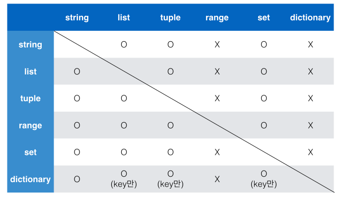

# 1. 컨테이너

> 여러개의 값을 저장할 수 있는 것

- 시퀀스형 : 순서가 있는 데이터
- 비 시퀀스형 : 순서가 없는 데이터


## 1.1 시퀀스형 컨테이너

> 시퀀스는 데이터가 순서대로 나열된 형식을 나타냄

- 정렬되었다는 의미는 아니니 주의
- 순서를 가질 수 있고, 특정 위치의 데이터를 가리키는게 가능
- 리스트, 튜블, 레인지, 문자형, 바이너리 등이 있음


### 1.1.1 리스트

- 활용법

```python
[value1, value2, value3]
```

- 리스트는 대괄호 `[]` 및 `list()`를 통해 생성 가능
- 값에 대한 접근은 `list[i]`를 통해 가능

### 1.1.2 튜플

- 활용법

``` python
(value1, value2)
```

- 튜플은 리스트와 비슷하지만 `()`로 묶어서 활용
- 튜플은 수정은 불가능하고 읽기만 가능

### 1.1.3 Range()

- 숫자의 시퀀스를 나타낼때 사용
- 기본형은 `range(n)`
- `range(n, m)`와 같이 사용하면 범위 지정가능 (n, m미만까지의 범위를 나타냄)
- `range(n, m, s)` `s` 단위로 증가하며 범위 지정


## 1.2 비 시퀀스형 컨테이너

### 1.2.1 Set

- `set`은 순서가 없는 자료구조
- `{}`를 통해 만들며, 순서가 없고 중복된 값이 없다.
- 공집합을 만들려면 `set()`을 사용해야 함
- 활용법

```python
{v1, v2, v3}
```

### 1.2.2 딕셔너리

- key와 value가 쌍으로 이뤄져 있는 형태

- 활용법

```python
{Key1:Value1, Key2:Value2, Key3:Value3, ...}
```

- 키는 변경 불가능한 데이터만 가능
- value는 뭐든지 가능


## 1.3 컨테이너형 형변환



- 컨테이너간 형변환이 가능(위의 표를 참조)


## 1.4 데이터의 분류

> 데이터는 변경 가능한 것과 불가능한 것으로 나뉜다.

### 1.4.1 변경 불가능한 데이터

단일 데이터

- 숫자
- 글자
- 참/거짓


### 1.4.2 변경 가능한 데이터

컨테이너

- list
- dict
- set
- 사용자가 만든 데이터 타입